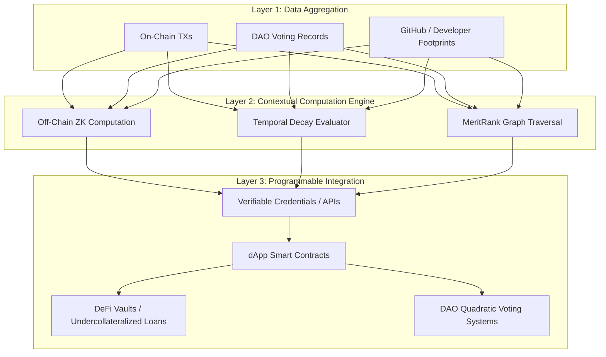

# Programmable and Contextual Reputation in Web3: The $ANSEM Score as a Model for Advancing Digital Credit

[](#abstract)
[](LICENSE)
[](#key-concepts)
[](#architecture)

---

## 📄 Abstract

As Web3 transitions from purely financial primitives to complex social landscapes known as **Decentralized Societies (DeSoc)**, the absence of standardized, portable, and multi-dimensional trust metrics presents a systemic bottleneck. Traditional on-chain metrics have relied almost exclusively on static token balances or non-transferable Soulbound Tokens (SBTs), which fail to capture temporal engagement or domain-specific competencies.

This research introduces the paradigm shift toward **"Programmable and Contextual Reputation,"** taking the **$ANSEM Score** as a case study. By coupling off-chain Zero-Knowledge (ZK) computations with dynamic on-chain cryptographic states, this model decouples trust into domain-isolated indexes, protects user privacy, mitigates plutocratic manipulation (Sybil attacks), and enables practical applications such as **undercollateralized lending** in DeFi and merit-weighted DAO governance.

---

## 📑 Table of Contents

- [Core Principles](#-core-principles)
- [System Architecture](#-system-architecture)
- [Mathematical Mechanics](#-mathematical-mechanics)
  - [Temporal Decay Function](#1-temporal-decay-function)
  - [Sybil Isolation (Graph Traversal)](#2-sybil-isolation-meritrank)
- [Practical Use Cases](#-practical-use-cases)
  - [DeFi: Undercollateralized Lending](#1-defi-undercollateralized-lending)
  - [Sybil-Resistant DAO Governance](#2-sybil-resistant-dao-governance)
- [Repository Structure](#-repository-structure)
- [Citation](#-citation)
- [License & Acknowledgments](#-license--acknowledgments)

---

## 💡 Core Principles

1. **Contextual & Domain Isolation:** Reputation in software development does not equal governance authority or lending capacity. Domain trust scores are decoupled to prevent capital-driven dominance.
2. **Dynamic Commitment (Dollar Days):** Mitigates momentary liquidity spikes by measuring $Capital \times Time$ alongside actual deployment footprints.
3. **Sovereign & Privacy-Preserving:** Leveraging Zero-Knowledge Proofs (ZKPs) allows individuals to prove they meet credit thresholds without doxxing historical activities.

---

## 🏗 System Architecture

The architecture decouples data ingestion, scoring, and smart contract execution into three independent, verifiable layers:



---

## 📐 Mathematical Mechanics

### 1. Temporal Decay Function
Reputation is treated as a depreciating asset without continuous, active participation. The cumulative score $R(t)$ at time $t$ decays exponentially:

$$R(t) = R_0 \cdot e^{-\lambda t} + \sum_{i} \left(\Delta R_i \cdot e^{-\lambda (t - t_i)}\right)$$

Where:
* $R_0$: Initial reputation score.
* $\lambda$: Domain-specific decay constant.
* $t$: Total elapsed inactive time.
* $\Delta R_i$: Marginal score earned through verifiable action at time $t_i$.

### 2. Sybil Isolation (MeritRank)
Rather than relying on global PageRank algorithms that are susceptible to bot networks, the system implements query-node-relative random walks. This clusters malicious Sybil attackers and dampens their influence outward across the trust graph.

---

## 🚀 Practical Use Cases

### 1. DeFi: Undercollateralized Lending
Traditional DeFi operates inefficiently with **overcollateralization** ($150\%+$ locked collateral). The $ANSEM score enables dynamic, risk-adjusted margin lending based on verifiable historical credibility.

| Metric | Traditional DeFi Model | Contextual DeFi ($ANSEM) |
| :--- | :--- | :--- |
| **Verification Basis** | Token balance only (Static) | Contextual Score ($Capital \times Time$ + Merit) |
| **Collateral Ratio** | $150\%$ (Overcollateralized) | $\le 50\%$ (Undercollateralized) |
| **Capital Efficiency** | Low (Trapped liquidity) | High (Optimized liquidity routing) |

### 2. Sybil-Resistant DAO Governance
Eliminates plutocratic *"1-Token-1-Vote"* vulnerabilities by weighting voting weight by technical contribution credentials, deployment history, and long-term protocol engagement.

---

## 📁 Repository Structure

```plaintext
├── docs/
│   ├── figures/               # High-res paper figures (Figure 1, Figure 2)
│   └── whitepaper.pdf         # Compiled publication PDF
├── contracts/                 # Prototype interfaces for reputation consumers
│   └── interfaces/
│       └── IContextualScore.sol
├── simulations/               # Python notebooks for decay models and simulations
│   ├── decay_function.py
│   └── graph_traversal.py
├── LICENSE
└── README.md
```

---

## 📚 Citation

If you use or reference this research paper in your protocol, implementation, or academic writing, please cite it as:

```bibtex
@article{ansem_reputation_web3,
  title     = {Programmable and Contextual Reputation in Web3: The \$ANSEM Score as a Model for Advancing Digital Credit},
  author    = {Open Standard Research},
  journal   = {Technical Reference Architecture for Decentralized Identity and Trust Layers},
  year      = {2026}
}
```

---

## 📜 References

* **Bhutta, M. N. M., et al.** (2021). *A survey on blockchain technology: Evolution, architecture and security.* IEEE Access.
* **Guan, C., Ding, D., Guo, J., & Teng, Y.** (2023). *An ecosystem approach to Web3.0.* Journal of Electronic Business & Digital Economics.
* **Lage, O., Saiz Santos, M., & Zarzuelo, J. M.** (2022). *Decentralized platform economy.* Electronic Markets.
* **Raval, S.** (2016). *Decentralized applications: Harnessing Bitcoin's blockchain technology.* O'Reilly Media.
* **Zheng, Z., et al.** (2018). *Blockchain challenges and opportunities: a survey.* Int. J. of Web and Grid Services.
